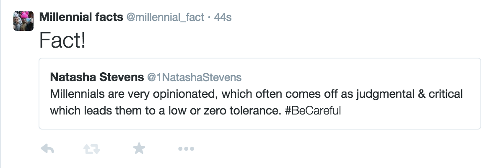

## Twitter bot memo

I want to make a bot called "Millennial facts" 

1. This bot will use the Twitter API to search for tweets with phrases like "millennials are" or "millennials like" 

2. It will take that text and and retweet it with the added comment, “Fact!” 

3. In practice, when the account @1NatashaStevens sends out the [tweet](https://twitter.com/1NatashaStevens/status/587820884603318273) “Millennials are very opinionated, which often comes off as judgmental & critical which leads them to a low or zero tolerance. #BeCareful” the bot would then tweet out:

	

It would even pick up this tweet: https://twitter.com/dancow/status/590585021896990721

It could be amusing, but more than anything I'm interested in seeing what all people are writing about millennials on social media. I predict I'll catch some "fun" think pieces on millennials and some random commentary from individuals. I’ve already signed up for a Twitter account with the handle @millennial_fact